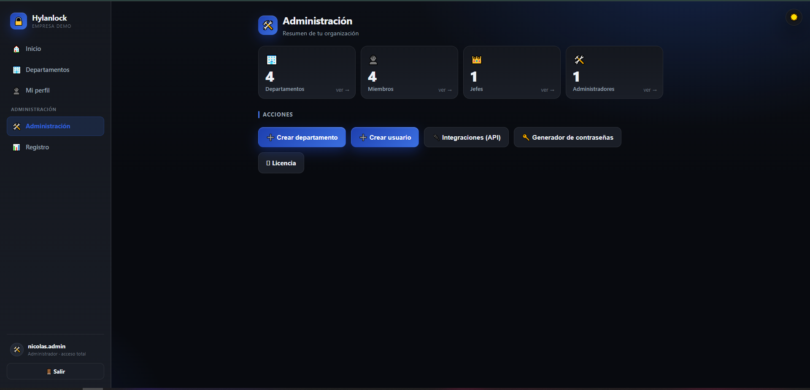
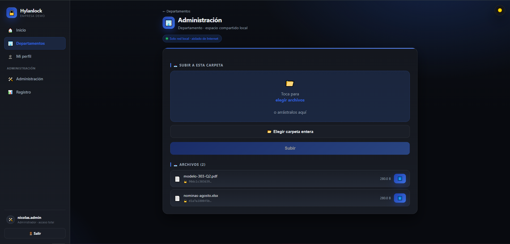
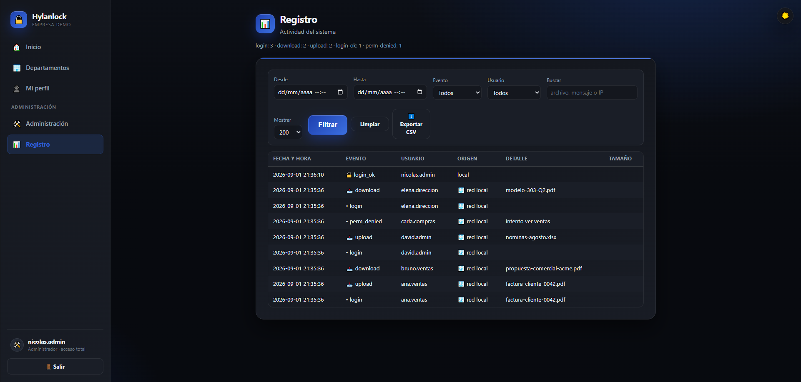

# Hylanlock

**Transferencia de archivos empresarial, self-hosted y bajo tu control.**

Plataforma de transferencia y gestión de archivos para empresas que necesitan **control real del
dato**: quién accede a qué, quién movió qué, y todo en **tu propio servidor**, no en el de un tercero.

> **Idea central:** *dejar un archivo* y *ver la carpeta* son **permisos distintos**. En la mayoría de
> herramientas, para que alguien te deje algo tienes que darle acceso a toda la carpeta. Aquí no: son
> dos permisos separados, y de ahí sale el resto del modelo.

---

## Capturas

**Panel de administración** — un vistazo a toda la organización de un golpe:



**Un departamento** — los archivos, con permisos separados por acción:



**Auditoría** — quién movió qué y a quién se le denegó, con filtros (y exportable a CSV):



---

## Qué resuelve

El correo, la nube o el disco compartido valen para muchos casos. Pero algunas organizaciones necesitan
más control sobre **cómo y dónde** se mueven sus archivos:

- Que **dejar un archivo** y **ver la carpeta** sean permisos distintos (buzones de entrega).
- Una estructura de acceso que siga la del **organigrama** (departamentos).
- Saber **quién movió qué**, y a quién se le denegó (auditoría).
- Los archivos en **el servidor de la empresa**, no en el de otro (self-hosted, aislado a la LAN).

## Características

- **Permisos por acción** — ver, listar, subir, descargar y borrar son permisos separados y se conceden
  por separado (RBAC).
- **Buzones de entrega (ACL asimétrica)** — deja que alguien te deposite archivos sin que vea lo que hay
  dentro de la carpeta.
- **Departamentos** — cada uno con sus reglas; pertenecer a la empresa no da acceso: el acceso se concede.
- **API para integraciones** — tu ERP o tus scripts depositan y leen archivos con una cuenta de servicio
  y los permisos de siempre. Ver [`API.md`](API.md).
- **Agente de sincronización** — los archivos llegan solos al PC del usuario, con el SHA-256 comprobado
  antes de escribirlos (nunca ejecuta nada).
- **Active Directory / LDAP** (opcional) — entrada con las credenciales de dominio; los grupos deciden
  el acceso, incluidos grupos anidados, sobre LDAPS con validación de certificado.
- **Auditoría** — quién entró, qué movió y qué se le denegó; exportable a CSV. Los avisos salen de ese
  mismo registro.
- **Licencias/trial offline** — verificación de licencia sin "llamar a casa" (Ed25519). Al caducar se
  **bloquea el uso pero nunca se tocan los datos**: el administrador siempre puede exportarlos.

## Seguridad

- **Self-hosted y aislado a la red local (LAN)** por diseño.
- **Solo biblioteca estándar de Python** en el núcleo (sin dependencias): superficie de ataque pequeña.
- **Código auditable** — por eso es source-available: puedes leer exactamente qué hace.
- Sesiones firmadas (HMAC), CSRF, contraseñas con PBKDF2, subida/descarga con protección contra
  *path traversal*, y un único punto de autorización. Ver [`HTTPS.md`](HTTPS.md) para servir con TLS.

> Como todo software, Hylanlock no promete seguridad absoluta: la seguridad real depende también de
> cómo lo despliegue y configure cada organización.

## Probarlo

Requiere Docker. En resumen (guía completa en [`DESPLIEGUE.md`](DESPLIEGUE.md)):

```bash
cp .env.example .env      # ajusta tus valores
docker compose up -d      # arranca
```

Al abrirlo por primera vez, un **asistente** te guía para crear el administrador e instalar tu licencia
de prueba. Copias de seguridad en [`BACKUPS.md`](BACKUPS.md); servir por HTTPS en [`HTTPS.md`](HTTPS.md).

## Estado

**Fase de validación.** El producto está construido, probado y auditado; buscamos las primeras empresas
que quieran probarlo y ayudar a mejorarlo con feedback real. Web: <https://hylanlock.vercel.app>

## Licencia

Hylanlock se publica bajo la **Business Source License 1.1** (ver [`LICENSE`](LICENSE)):

- **Probar y usar en no-producción es gratis** (evaluación, desarrollo, pruebas).
- **Usarlo en producción** (mover archivos reales de una organización) **requiere una licencia
  comercial**.
- El código se **abre automáticamente** (Apache 2.0) en la *Change Date* indicada en la licencia.

Para licencias comerciales o cualquier duda: **hylanlock@gmail.com**.

---

*Hylanlock es un proyecto de Nicolás Muñoz Rodríguez.*
